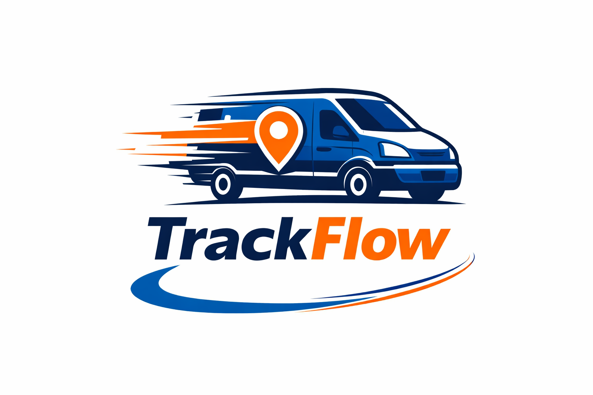

# Trackflow Inc.

## Company Overview

Track Flow is your logistics partner for secure warehousing, smooth operations, and on-time last-mile delivery.

## Product & Service

Track Flow provides warehousing, inventory management, order fulfillment, and last-mile delivery solutions for businesses that need speed, organization, and reliability. We help companies store, process, and move products efficiently from warehouse to final destination. Our operations cover major cities, nearby regional markets, and strategic commercial routes, giving our clients the flexibility to scale their logistics with confidence.
## Branding:
- Color: Flow Blue – #2563EB. Very common promotes a sense of reliability.
- Motto: "Faster routes, smarter deliveries"
- Logo: 

