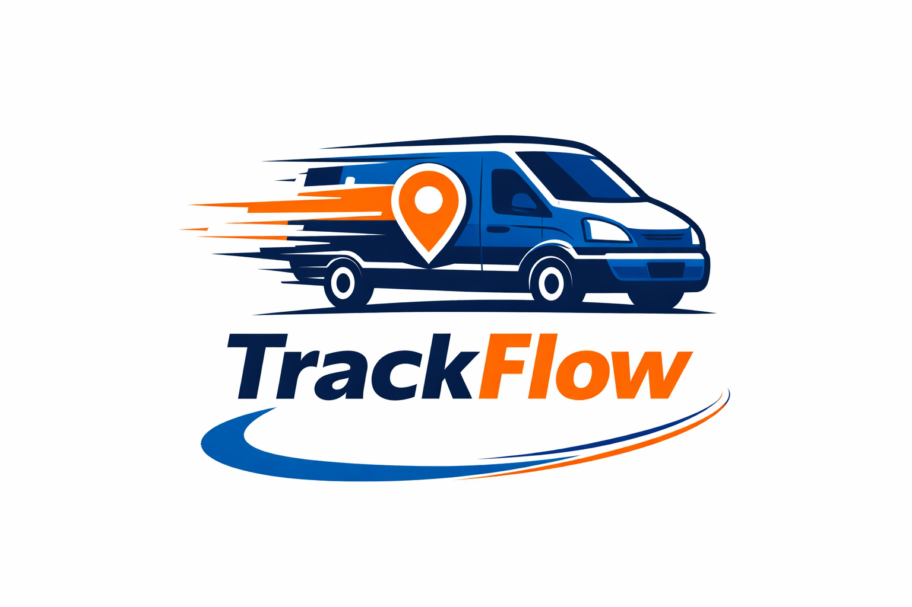

# Trackflow Inc.

## Company Overview

Track Flow is your logistics partner for secure warehousing, smooth operations, and on-time last-mile delivery.

## Product & Service

Track Flow provides warehousing, inventory management, order fulfillment, and last-mile delivery solutions for businesses that need speed, organization, and reliability. We help companies store, process, and move products efficiently from warehouse to final destination. Our operations cover major cities, nearby regional markets, and strategic commercial routes, giving our clients the flexibility to scale their logistics with confidence.
## Branding:
- Color: Flow Blue – #2563EB. Very common promotes a sense of reliability.
- Motto: "Faster routes, smarter deliveries"
- Logo: 

# Welcome to TrackFlow

## AI Engineering · 4Geeks Academy — Company Briefing

---

TrackFlow is a last-mile delivery and warehouse management company founded in 2009 in Los Angeles, United States. It operates in two markets — United States and Spain — with warehouses in Los Angeles and Zaragoza. The company employs approximately 130 people and generates around 9 million euros in annual revenue.

TrackFlow exists because e-commerce brands are good at making and selling products, but not at getting those products to customers' doors. TrackFlow does that for them: it stores their inventory, picks and packs orders, ships them out through a network of carriers, and handles returns when things come back. For the brands that work with TrackFlow, the entire logistics operation — from the moment an order is placed to the moment it is delivered or returned — is TrackFlow's problem to solve.

## How the company is organised

TrackFlow is led by **Thomas Harry**, the founder and CEO, based in Los Angeles. The company has a technology office in Zaragoza, Spain, where CTO Andrés Kim and most of the tech team are based. Operations, commercial, and customer-facing teams are distributed between the two countries.

The company is organised around the following areas:

**Warehouse Operations** is where the physical work of logistics happens. Ana Whitfield oversees the two warehouses — one in Los Angeles, one in Zaragoza — and the roughly 70 operatives who run them. Every day, hundreds of orders arrive, get picked from shelves, packed into boxes, and handed off to carriers. The two warehouses currently run on different systems and have no shared view of inventory.

**Last Mile and Carrier Management** handles the relationship with the 8 carriers TrackFlow works with across the two countries — among them UPS, FedEx, MRW, and SEUR. Carlos Vega coordinates which carrier gets which shipment, tracks deliveries, and manages the incidents that inevitably occur: lost parcels, failed deliveries, wrong addresses. Right now, most of this is done manually, carrier by carrier.

**Reverse Logistics** manages what happens when a product comes back. Sofía Ramos leads this team of five. Returns represent between 18% and 25% of total volume depending on the client and country, and every return involves a chain of decisions — approve or reject, collect or not, recondition or dispose — that currently all pass through human review.

**Customer Experience** is the frontline between TrackFlow and the people it serves. Valentina Cruz manages 15 agents in Los Angeles and Zaragoza who handle queries from both the brands (who want to know how their operations are performing) and the end consumers (who want to know where their parcel is). The vast majority of queries are repetitive, and right now every single one is answered by a human.

**Commercial and Client Relations** manages TrackFlow's portfolio of brand clients. Miguel Torres leads account managers and business development people who are responsible for retaining existing clients and winning new ones. Client contracts run annually, and renewals are won or lost based on whether clients feel their logistics operation is running well.

**Technology** is the team building and maintaining everything. Andrés Kim leads a team of developers, data engineers, and systems people from Zaragoza. The current architecture is a patchwork: two different warehouse systems, an ERP from the early 2010s, and integrations between them that were built quickly and never properly documented. When something breaks, the team finds out through a WhatsApp message from someone in operations.

**Executive Leadership** sits with Thomas, who manages the business from Los Angeles with a weekly consolidated report that each director prepares manually — a process that consumes hours every Sunday evening and still delivers data that is already a day or two old.

## Where the company stands today

TrackFlow has good clients, a skilled operations team, and a clear value proposition. What it lacks is the infrastructure to run a two-country logistics business at scale. The two warehouses cannot see each other's inventory. Carrier performance data does not exist in any structured form. Returns are approved or rejected one by one. Customer queries are answered by agents consulting a Word document on Google Drive. The CEO makes decisions based on a report assembled by hand.

The consequence is that TrackFlow is slower, more error-prone, and less profitable than it needs to be — and the gap is growing as competitors invest in automation.

Daniel has created an internal unit called **TrackFlow Tech** with a clear mandate: build the systems, integrations, and intelligent automations that allow TrackFlow to operate as the modern logistics company it needs to become.

**You are part of that unit.**

---

---

## The Departments and Their Problems

### 🚚 Warehouse Operations

**Manager:** Ana Whitfield (~70 operatives + 2 warehouse managers)

Los Angeles and Zaragoza each use a different warehouse management system — one is commercial software, the other is an advanced spreadsheet. Real-time inventory visibility doesn't exist at a global level. Inbound orders arrive by email in different formats and are manually transcribed. Picking is done with printed paper lists. Inventory discrepancies are frequent and detected late.

**What they need:** A unified inventory API returning real-time stock for any SKU in either warehouse, an order ingestion pipeline that parses emails automatically, a warehouse operations dashboard, and low-stock alerts that notify clients and the procurement team.

---

### 📦 Last Mile and Carrier Management

**Manager:** Carlos Vega (6 logistics coordinators)

TrackFlow works with 8 carriers across both countries (UPS, FedEx, DHL in the United States; MRW, SEUR, DHL in Spain, plus two local carriers). Carrier assignment is manual. Package tracking requires checking multiple carrier portals individually. There is no historical performance data: no on-time delivery rate, no incidents per route, no cost per kg.

**What they need:** A carrier selection engine that recommends the optimal carrier given destination, weight, and urgency; a unified tracking endpoint aggregating status from any carrier; a public tracking portal for recipients; and a carrier performance dashboard.

---

### 🔄 Reverse Logistics

**Manager:** Sofía Ramos (5-person team)

Returns represent 18–25% of volume depending on client and country. Every return goes through manual review — there are no automatic approval criteria. Product inspection after return is subjective and inconsistent. There is no visibility into which products are returned most and why.

**What they need:** An automatic returns approval engine with configurable per-client rules, an automated collection flow (approval → label → carrier schedule), an AI-assisted inspection system where the operative photographs the product and AI classifies its condition, and a returns dashboard with pattern analysis.

---

### 📞 Customer Experience

**Manager:** Valentina Cruz (15 agents in Los Angeles and Zaragoza)

TrackFlow serves two customer types: brands (B2B) and end consumers (B2C). The 15 agents handle both through email, WhatsApp, and phone with no unified ticketing system. 80% of queries could be answered automatically. There is no knowledge base. Coverage outside office hours is zero.

**What they need:** A first-line CX agent resolving tracking queries and return status automatically, a semantic knowledge base indexed for RAG, a unified ticketing system, a real-time CX dashboard, and sentiment analysis to detect frustrated customers before escalation. Multilingual support (Spanish + English) is optional but highly recommended, starting from one base language.

---

### 🤝 Commercial and Client Relations

**Manager:** Miguel Torres (4 account managers + 4 business development)

Account managers track their accounts in personal spreadsheets and email threads — there is no CRM. Client reporting is manual: each month an account manager compiles data from different systems to send each client a PDF. There is no visibility into which clients are at risk of not renewing.

**What they need:** A CRM integration with unified client profiles, automated client PDF reports generated by an agent, a client health dashboard with renewal risk scores, 90 and 30-day renewal alerts, and a commercial agent that suggests relevant services to prospects.

---

### 💻 Technology

**CTO:** Andrés Kim (7-person team in Zaragoza)

TrackFlow's tech architecture is the result of years of unplanned growth: two different WMS systems, a legacy ERP from the early 2010s, undocumented point-to-point Python scripts, and databases in two different cloud providers. There is no centralised telemetry. When an endpoint fails in Los Angeles, the Zaragoza team finds out via WhatsApp. Deployment of a new feature takes one to two weeks.

**What they need:** Centralised telemetry and logging from both countries, a data pipeline feeding all company dashboards, real-time monitoring with automatic alerts, a technical documentation agent, and automated ops tasks (backups, health checks, incident notifications).

---

### 📊 Executive Direction

**CEO:** Daniel Espinoza

Daniel receives a consolidated report every Monday that his directors prepare on Sunday evening — 3 to 4 hours of work per director. By 10am Monday, some data is already two days old. There is no unified view of the business by country. Strategic decisions are made with partial data.

**What he needs:** A global executive dashboard with real-time KPIs from both operations (shipment volume, on-time delivery, costs, returns, CSAT), an automatically generated weekly report at 7am Monday, country comparison views, threshold alerts, and a natural-language AI assistant.

--

## Why Choose TrackFlow?

Choose TrackFlow if you are drawn to:

- **Logistics and physical operations** — every line of code you write is connected to a parcel moving from a warehouse shelf to someone's front door.
- **Cross-border complexity** — two countries, two languages, two regulatory environments, and two separate tech stacks that need to be unified.
- **Data engineering at its most concrete** — carrier performance metrics, SKU-level inventory, shipment event streams, and returns classification are all structured, measurable, and visually compelling in dashboards.
- **Systems that run 24/7** — TrackFlow's customers don't stop expecting their parcels after 6pm. The CX agent, tracking portal, and operations dashboard all need to be always-on.

The AI challenges at TrackFlow include image-based product condition classification for returns, semantic search over logistics policies in two languages, intelligent carrier selection with explainable recommendations, and a real-time parcel tracking aggregator pulling data from 8 different carrier APIs. If you want to build systems that handle physical-world complexity at scale, TrackFlow is your company.

---

_Internal document — 4Geeks Academy · AI Engineering Track_
_For exclusive use in programme project generation_
